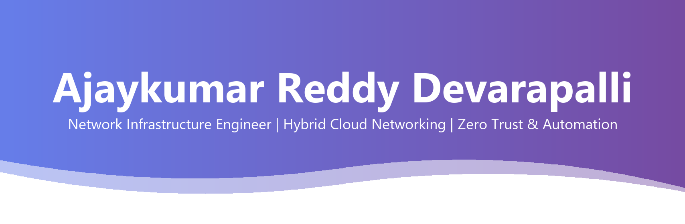
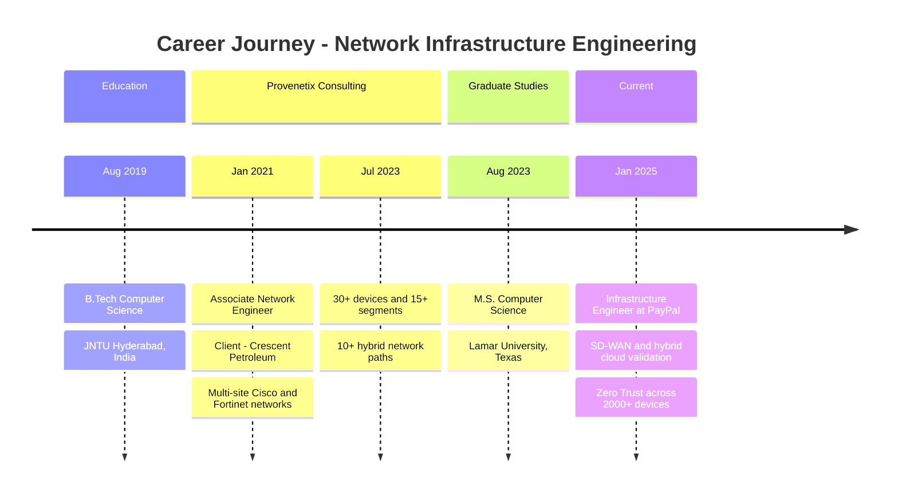
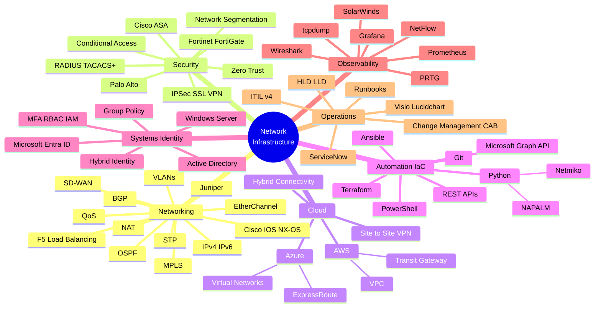

---

## 🎯 Professional Summary

**Network Infrastructure Engineer** | **Hybrid Cloud Networking** | **Network Security & Automation**

Network Infrastructure Engineer with **4+ years** across enterprise LAN/WAN, hybrid cloud networking (**AWS/Azure**), network security, systems and identity infrastructure, and automation. Currently at **PayPal**, validating SD-WAN, firewall, and hybrid-cloud changes with network and security teams, enforcing Zero Trust access, and troubleshooting DNS, DHCP, VPN, and authentication issues across hybrid environments. Previously built and operated multi-site **Cisco and Fortinet** networks for an energy-sector client. Strong in BGP/OSPF, secure connectivity, observability, and automation with Python, Ansible, Terraform, and Netmiko/NAPALM. **M.S. Computer Science; CCNA.**

**Core Competencies:**
- 🌐 **Enterprise Networking:** BGP, OSPF, MPLS, VLANs, STP, EtherChannel, SD-WAN, Cisco IOS/NX-OS, Juniper, F5
- ☁️ **Hybrid Cloud:** AWS VPC & Transit Gateway, Azure Virtual Networks & ExpressRoute, Site-to-Site VPN
- 🔐 **Network Security:** Cisco ASA, Fortinet FortiGate, Palo Alto, IPSec/SSL VPN, Zero Trust, RADIUS/TACACS+
- 🪪 **Systems & Identity:** Windows Server, Active Directory, Group Policy, Microsoft Entra ID, MFA, RBAC
- 🤖 **Automation:** Python (Netmiko, NAPALM), Ansible, Terraform, PowerShell, Microsoft Graph API
- 🎓 **Certifications:** Cisco Certified Network Associate (CCNA)

---

## 🏛️ Hybrid Network Infrastructure Expertise

```mermaid
graph TB
    subgraph Edge["🏢 Enterprise Sites"]
        A1[Multi-site LAN/WAN]
        A2[Cisco IOS/NX-OS]
        A3[Juniper]
        A4[Wireless LAN]
    end

    subgraph Routing["🔀 Routing & WAN"]
        B1[BGP / OSPF]
        B2[MPLS]
        B3[SD-WAN]
        B4[F5 Load Balancing]
    end

    subgraph Security["🔐 Security Layer"]
        C1[Cisco ASA]
        C2[Fortinet FortiGate]
        C3[Palo Alto]
        C4[IPSec / SSL / GRE]
    end

    subgraph Cloud["☁️ Hybrid Cloud"]
        D1[AWS VPC]
        D2[AWS Transit Gateway]
        D3[Azure VNets]
        D4[Azure ExpressRoute]
    end

    subgraph Identity["🪪 Identity & Access"]
        E1[Active Directory]
        E2[Microsoft Entra ID]
        E3[Zero Trust / MFA / RBAC]
    end

    subgraph Ops["📊 Automation & Observability"]
        F1[Python / Ansible / Terraform]
        F2[SolarWinds / PRTG]
        F3[Wireshark / NetFlow]
        F4[Prometheus / Grafana]
    end

    A1 & A2 & A3 & A4 --> B1 & B2 & B3 & B4
    B1 & B2 & B3 & B4 --> C1 & C2 & C3 & C4
    C1 & C2 & C3 & C4 --> D1 & D2 & D3 & D4
    E1 & E2 & E3 -.->|Secures access| C1 & D1 & D3
    F1 & F2 & F3 & F4 -.->|Automates & monitors| B1 & C1 & D1

    style Edge fill:#667eea,stroke:#764ba2,stroke-width:3px,color:#fff
    style Routing fill:#f093fb,stroke:#f5576c,stroke-width:3px,color:#fff
    style Security fill:#fa709a,stroke:#fee140,stroke-width:3px,color:#fff
    style Cloud fill:#4facfe,stroke:#00f2fe,stroke-width:3px,color:#fff
    style Identity fill:#43e97b,stroke:#38f9d7,stroke-width:3px,color:#fff
    style Ops fill:#30cfd0,stroke:#330867,stroke-width:3px,color:#fff
```

---

## 💼 Professional Experience Timeline

---

## 🛠️ Technology Stack & Expertise

---

## 📊 Technical Skills

### **Primary Technology Stack**

| **Category** | **Technologies** |
|:------------|:----------------|
| 🌐 **Networking** | BGP, OSPF, MPLS, VLANs, STP, EtherChannel, NAT, QoS, DNS, DHCP, IPv4/IPv6, SD-WAN, Cisco IOS/NX-OS, Juniper, F5 Load Balancing |
| 🔐 **Security** | Cisco ASA, Fortinet FortiGate, Palo Alto, IPSec/SSL VPN, Zero Trust, Conditional Access, RADIUS/TACACS+, Network Segmentation |
| ☁️ **Cloud** | AWS VPC, Transit Gateway, Azure Virtual Networks, ExpressRoute, Site-to-Site VPN, Hybrid Connectivity |
| 🤖 **Automation / IaC** | Python (Netmiko, NAPALM), Ansible, Terraform, PowerShell, REST APIs, Microsoft Graph API, Git |
| 🪪 **Systems & Identity** | Windows Server Administration, Active Directory, Group Policy (GPO), Microsoft Entra ID, Hybrid Identity, MFA, RBAC, IAM |
| 📈 **Observability** | SolarWinds, PRTG, Wireshark, tcpdump, NetFlow, Prometheus, Grafana |
| 📋 **Operations** | ServiceNow, ITIL v4, Change Management / CAB, HLD/LLD, Visio, Lucidchart, Runbooks |

---

## 💼 Professional Experience Deep Dive

### 🏢 **Infrastructure Engineer @ PayPal** | *Jan 2025 – Present* | Texas, USA

**Hybrid Network Validation, Zero Trust & Automation:**
- ✅ Validate **SD-WAN, firewall, and hybrid Azure/AWS** network changes with network and security teams before production rollout, including readiness checks for rollouts affecting **5,000+ users**
- 🔍 Troubleshoot and resolve escalated **DNS, DHCP, VPN, and connectivity** issues across hybrid environments using Wireshark, Prometheus/Grafana, and system logs; eliminate recurring root causes to reduce repeat tickets
- 🔐 Implement **Zero Trust access controls** (Entra ID Conditional Access, MFA, RBAC) across a **2,000+ device** environment to secure network and application access
- 🪪 Investigate escalated authentication and provisioning issues across **hybrid Active Directory and Entra ID** environments, supporting Windows Server-based identity infrastructure
- 🤖 Automate configuration reporting and compliance checks with **Ansible, PowerShell, Terraform, and Microsoft Graph API**, reducing manual work by **~35%**
- 📐 Maintain Visio network diagrams, runbooks, and **ITIL v4** change documentation; participate in **CAB** to plan deployment windows, rollback plans, and post-implementation reviews
- 🤝 Mentor newer team members on troubleshooting methodology and deployment workflows

**Key Technologies:** `SD-WAN` `Azure` `AWS` `Wireshark` `Prometheus` `Grafana` `Entra ID` `Active Directory` `Ansible` `PowerShell` `Terraform` `Microsoft Graph API` `ITIL v4`

---

### 🏢 **Associate Network Engineer @ Provenetix Consulting Services** | *Jan 2021 – Jul 2023* | India
*Client: Crescent Petroleum*

**Multi-site Enterprise Networking & Hybrid Connectivity:**
- 🌐 Built and maintained multi-site **LAN/WAN on Cisco IOS/NX-OS** (BGP, OSPF, MPLS, VLANs, EtherChannel) across **30+ devices** and **15+ network segments**
- ⚡ Tuned **BGP route policy and prefix filtering** for ISP peering, reducing routing convergence time by **~22%**
- 🛡️ Configured **Cisco ASA and FortiGate** firewalls, IPSec/SSL and GRE tunnels, RADIUS/TACACS+ authentication, and F5 load balancers; supported wireless LAN design for office and branch sites
- ☁️ Delivered hybrid connectivity across **Azure VNets/ExpressRoute and AWS VPC/Transit Gateway** for **10+ hybrid network paths**
- 🐍 Wrote **Python (Netmiko, NAPALM), PowerShell, and Ansible** automation for configuration validation and compliance checks, reducing manual configuration work by **~45%**
- 📊 Monitored performance with **SolarWinds, PRTG, Wireshark, and NetFlow**, reducing MTTR by **~30%**; resolved Tier 2/3 ServiceNow tickets at **98% SLA adherence**
- 📝 Ran validation for network upgrades, hardware changes, and SD-WAN migrations; authored HLD/LLD documentation, network diagrams, runbooks, and validation reports

**Key Technologies:** `Cisco IOS/NX-OS` `BGP` `OSPF` `MPLS` `Cisco ASA` `FortiGate` `F5` `Azure ExpressRoute` `AWS Transit Gateway` `Python` `Netmiko` `NAPALM` `Ansible` `SolarWinds` `PRTG` `NetFlow` `ServiceNow`

---

## 🎓 Education

| **Degree** | **Institution** | **Duration** |
|:----------|:---------------|:------------:|
| 🎓 **Master of Science in Computer Science** | Lamar University, Beaumont, Texas | Aug 2023 – May 2025 |
| 🎓 **Bachelor of Technology in Computer Science** | Jawaharlal Nehru Technological University Hyderabad, India | Aug 2019 – May 2023 |

---

## 📜 Certifications

- 🏅 **Cisco Certified Network Associate (CCNA)**
- 🏅 **Network Automation with Python** — Coursera
- 🏅 **Windows Server Administration Fundamentals** — LinkedIn Learning

---

## 📫 Let's Connect

📍 **Texas, USA** &nbsp;|&nbsp; 📧 [dajaykumarnetworkeng@gmail.com](mailto:dajaykumarnetworkeng@gmail.com) &nbsp;|&nbsp; 📱 [+1 (469) 268-2398](tel:+14692682398)

