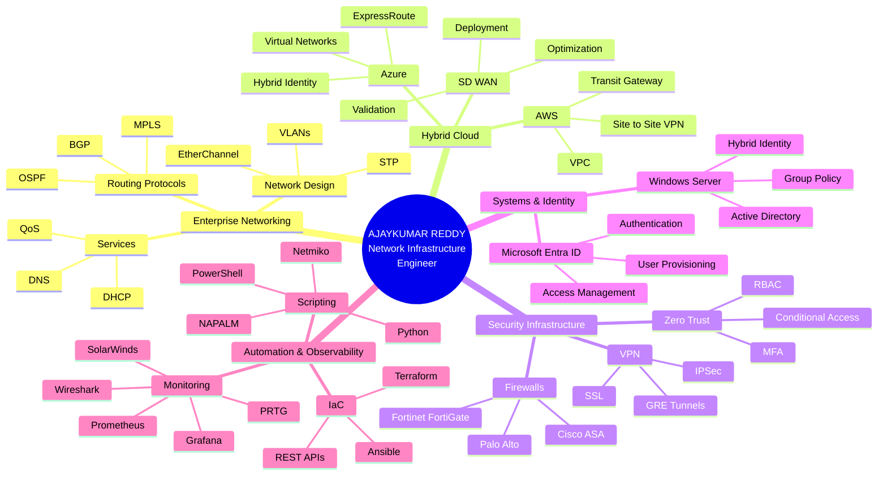
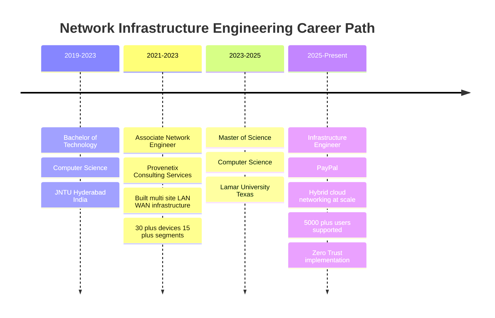

<!-- 
███╗   ██╗███████╗████████╗██╗    ██╗ ██████╗ ██████╗ ██╗  ██╗    ███████╗███╗   ██╗ ██████╗ ██╗███╗   ██╗███████╗███████╗██████╗ 
████╗  ██║██╔════╝╚══██╔══╝██║    ██║██╔═══██╗██╔══██╗██║ ██╔╝    ██╔════╝████╗  ██║██╔════╝ ██║████╗  ██║██╔════╝██╔════╝██╔══██╗
██╔██╗ ██║█████╗     ██║   ██║ █╗ ██║██║   ██║██████╔╝█████╔╝     █████╗  ██╔██╗ ██║██║  ███╗██║██╔██╗ ██║█████╗  █████╗  ██████╔╝
██║╚██╗██║██╔══╝     ██║   ██║███╗██║██║   ██║██╔══██╗██╔═██╗     ██╔══╝  ██║╚██╗██║██║   ██║██║██║╚██╗██║██╔══╝  ██╔══╝  ██╔══██╗
██║ ╚████║███████╗   ██║   ╚███╔███╔╝╚██████╔╝██║  ██║██║  ██╗    ███████╗██║ ╚████║╚██████╔╝██║██║ ╚████║███████╗███████╗██║  ██║
╚═╝  ╚═══╝╚══════╝   ╚═╝    ╚══╝╚══╝  ╚═════╝ ╚═╝  ╚═╝╚═╝  ╚═╝    ╚══════╝╚═╝  ╚═══╝ ╚═════╝ ╚═╝╚═╝  ╚═══╝╚══════╝╚══════╝╚═╝  ╚═╝
-->

<div align="center">

</div>

<div align="center">

```bash
┌─[ajaykumar@infrastructure]─[~/career-achievements]
└──╼ $ whoami
Network Infrastructure Engineer | Hybrid Cloud Specialist | Security & Automation Architect

┌─[ajaykumar@infrastructure]─[~/professional-stats]
└──╼ $ ls -la career-metrics/
drwxr-xr-x  4+ years of enterprise networking experience
drwxr-xr-x  5,000+ users supported in production environments
-rw-r--r--  35% automation efficiency improvement
-rw-r--r--  30% MTTR reduction through observability
-rw-r--r--  98% SLA adherence across Tier 2/3 support
-rw-r--r--  30+ network devices and 15+ segments managed
-rw-r--r--  22% routing convergence time optimization
-rw-r--r--  45% manual configuration reduction via automation
-rw-r--r--  2,000+ devices secured with Zero Trust controls
```

</div>

<table align="center">
<tr>
<td></td>
<td></td>
<td></td>
</tr>
</table>

<div align="center">

[](https://www.linkedin.com/in/ajaykumar-networkengineer/)
[](https://github.com/AjayReddy999)
[](https://applywizz-ajaykumarreddydevarapalli-26257.vercel.app/)
[](https://www.linkedin.com/in/ajaykumar-networkengineer/)

</div>

<div align="center">

</div>

---

## 🎯 Professional Identity

<table width="100%">
<tr>
<td width="50%" valign="top">

```typescript
class NetworkEngineer implements InfrastructureExpert {
  private identity = {
    name: "Ajaykumar Reddy Devarapalli",
    role: "Network Infrastructure Engineer",
    location: "Texas, USA",
    certification: "CCNA"
  };

  private expertise: TechStack = {
    networking: [
      "BGP", "OSPF", "MPLS", "SD-WAN",
      "VLANs", "STP", "EtherChannel",
      "NAT", "QoS", "IPv4/IPv6"
    ],
    cloudNetworking: [
      "AWS VPC", "Transit Gateway",
      "Azure Virtual Networks", "ExpressRoute",
      "Site-to-Site VPN", "Hybrid Connectivity"
    ],
    security: [
      "Zero Trust", "Conditional Access",
      "IPSec/SSL VPN", "Network Segmentation",
      "RADIUS/TACACS+", "MFA", "RBAC"
    ]
  };
}
```

</td>
<td width="50%" valign="top">

```python
infrastructure_achievements = {
    'experience_years': 4,
    'production_users_supported': '5000+',
    'network_devices_managed': 30,
    'network_segments_deployed': 15,
    'hybrid_cloud_paths': 10,
    'sla_adherence': '98%',
    'automation_efficiency': '+35%',
    'mttr_reduction': '-30%',
    'routing_optimization': '+22%',
    'manual_work_reduction': '-45%',
    'zero_trust_devices': 2000,
    'current_employer': 'PayPal',
    'previous_employer': 'Provenetix Consulting'
}

def career_impact():
    return """
    Architecting enterprise-grade network 
    infrastructure with hybrid cloud integration,
    Zero Trust security, and intelligent automation
    across Fortune 500 environments.
    """
```

</td>
</tr>
</table>

---

## 🚀 Career Architecture Mindmap



---

## 📊 Professional Journey Timeline



---

## 💼 Development Metrics Dashboard

<table align="center" width="100%">
<tr>
<td align="center" width="25%">

<br/>
<strong>Professional Experience</strong>
</td>
<td align="center" width="25%">

<br/>
<strong>Production Scale</strong>
</td>
<td align="center" width="25%">

<br/>
<strong>Service Quality</strong>
</td>
<td align="center" width="25%">

<br/>
<strong>Efficiency Gains</strong>
</td>
</tr>
<tr>
<td align="center" width="25%">

<br/>
<strong>Infrastructure Scale</strong>
</td>
<td align="center" width="25%">

<br/>
<strong>Incident Response</strong>
</td>
<td align="center" width="25%">

<br/>
<strong>Security Posture</strong>
</td>
<td align="center" width="25%">

<br/>
<strong>Technical Portfolio</strong>
</td>
</tr>
</table>

---

## 👨‍💻 About Me

I am a **Network Infrastructure Engineer** with over **4 years of enterprise experience** architecting, deploying, and securing mission-critical network infrastructure across hybrid cloud environments. Currently at **PayPal**, I validate SD-WAN, firewall, and hybrid Azure/AWS network changes affecting **5,000+ users**, implement Zero Trust access controls across **2,000+ devices**, and troubleshoot escalated DNS, DHCP, VPN, and authentication issues using advanced observability tools like Wireshark, Prometheus, and Grafana.

My technical foundation spans **enterprise LAN/WAN design** (BGP, OSPF, MPLS, VLANs, EtherChannel), **hybrid cloud networking** (AWS VPC, Transit Gateway, Azure Virtual Networks, ExpressRoute), **network security** (Cisco ASA, Fortinet FortiGate, Palo Alto, IPSec/SSL VPN), **systems and identity infrastructure** (Windows Server, Active Directory, Microsoft Entra ID, MFA, RBAC), and **intelligent automation** (Python, Ansible, Terraform, Netmiko, NAPALM, PowerShell).

At **Provenetix Consulting Services**, I built and maintained multi-site LAN/WAN infrastructure on **Cisco IOS/NX-OS** across **30+ devices and 15+ network segments**, optimized BGP route policy reducing routing convergence time by **22%**, delivered hybrid connectivity across **Azure VNets/ExpressRoute and AWS VPC/Transit Gateway** for **10+ hybrid network paths**, and authored Python/Ansible automation reducing manual configuration work by **45%**. My monitoring and troubleshooting expertise with **SolarWinds, PRTG, Wireshark, and NetFlow** reduced MTTR by **30%** while maintaining **98% SLA adherence** across Tier 2/3 ServiceNow tickets.

I hold a **Master of Science in Computer Science** from Lamar University, Texas, a **Bachelor of Technology in Computer Science** from JNTU Hyderabad, India, and **Cisco CCNA certification**. My approach combines deep technical expertise with business impact focus—I don't just deploy infrastructure, I architect resilient, secure, observable, and automated network ecosystems that enable business velocity while maintaining security and compliance posture.

Whether designing network segmentation strategies, implementing Zero Trust access controls, optimizing hybrid cloud connectivity, or building automation workflows, I bring a **production-first mindset** with emphasis on documentation, change management (ITIL v4, CAB participation), runbook creation, and knowledge transfer to empower teams and reduce operational overhead.

---

## 🏢 Professional Experience

<table width="100%">
<tr>
<td width="50%" valign="top">

### 🚀 Infrastructure Engineer
**`PayPal • Texas, USA • Jan 2025 – Present`**


<img src="https